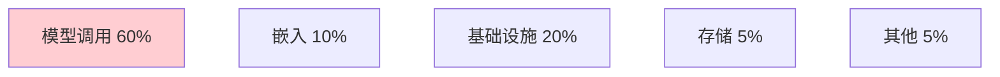

# 成本分析图解

> 用图解理解成本构成和优化策略。

---

## 一、成本构成


```mermaid
graph TB
    C1["模型调用 60%"]
    C2["嵌入 10%"]
    C3["基础设施 20%"]
    C4["存储 5%"]
    C5["其他 5%"]

    style C1 fill:#FFCDD2
```

---

## 二、优化

```mermaid
graph TB
    ROUTE["模型路由 -60%"]
    CACHE["语义缓存 -30%"]
    COMPRESS["上下文压缩 -50%"]

    style ROUTE fill:#C8E6C9
