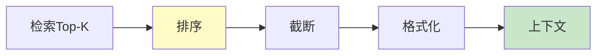

# 上下文组装图解

> 用图解理解组装流程和Token预算。

---

## 一、组装流程

```mermaid
graph LR
    RET["检索Top-K"] --> SORT["排序"] --> TRUNC["截断"] --> FORMAT["格式化"] --> OUT["上下文"]

    style SORT fill:#FFF9C4
    style OUT fill:#C8E6C9
```

---

## 二、检查清单

| 检查项 | 状态 |
|--------|------|
| 有组装器 | ☐ |
