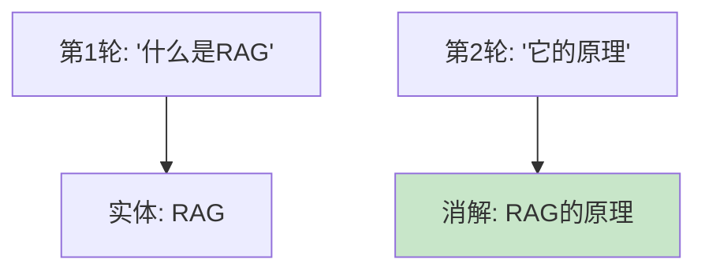

# 多轮对话图解

> 用图解理解指代消解和话题检测。

---

## 一、指代消解

```mermaid
graph TB
    T1["第1轮: '什么是RAG'"] --> E["实体: RAG"]
    T2["第2轮: '它的原理'"] --> R["消解: RAG的原理"]

    style R fill:#C8E6C9
```

---

## 二、检查清单

| 检查项 | 状态 |
|--------|------|
| 有指代消解 | ☐ |
