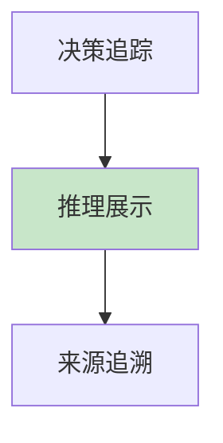

# 决策可解释性图解

> 用图解理解决策追踪和来源追溯。

---

## 一、三层

```mermaid
graph TB
    L1["决策追踪"] --> L2["推理展示"] --> L3["来源追溯"]

    style L2 fill:#C8E6C9
```

---

## 二、检查清单

| 检查项 | 状态 |
|--------|------|
| 有决策追踪 | ☐ |
| 有来源追溯 | ☐ |
