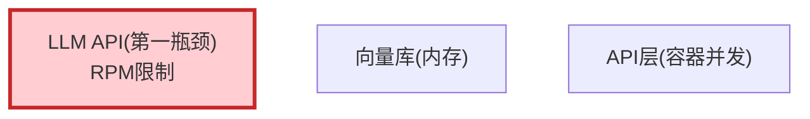

# 容量规划图解

> 用图解理解 QPS 预估和瓶颈识别。

---

## 一、规划流程

```mermaid
graph LR
    S1["QPS预估"] --> S2["资源计算"] --> S3["瓶颈识别"] --> S4["扩容"]

    style S3 fill:#FFCDD2
    style S4 fill:#C8E6C9
```

---

## 二、瓶颈

```mermaid
graph TB
    B1["LLM API(第一瓶颈)<br/>RPM限制"]
    B2["向量库(内存)"]
    B3["API层(容器并发)"]

    style B1 fill:#FFCDD2,stroke:#C62828,stroke-width:3px
```

---

## 三、检查清单

| 检查项 | 状态 |
|--------|------|
| 有QPS预估 | ☐ |
| 有瓶颈识别 | ☐ |
