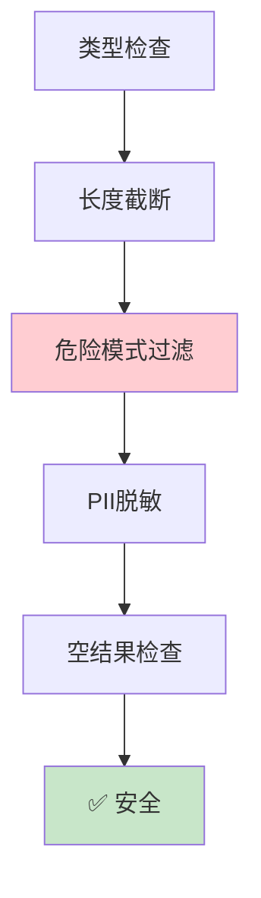

# 工具结果验证图解

> 用图解理解 5 层验证。

---

## 一、5层验证

```mermaid
graph TB
    T1["类型检查"] --> T2["长度截断"]
    T2 --> T3["危险模式过滤"]
    T3 --> T4["PII脱敏"]
    T4 --> T5["空结果检查"]
    T5 --> SAFE["✅ 安全"]

    style T3 fill:#FFCDD2
    style SAFE fill:#C8E6C9
```

---

## 二、检查清单

| 检查项 | 状态 |
|--------|------|
| 有5层验证器 | ☐ |
