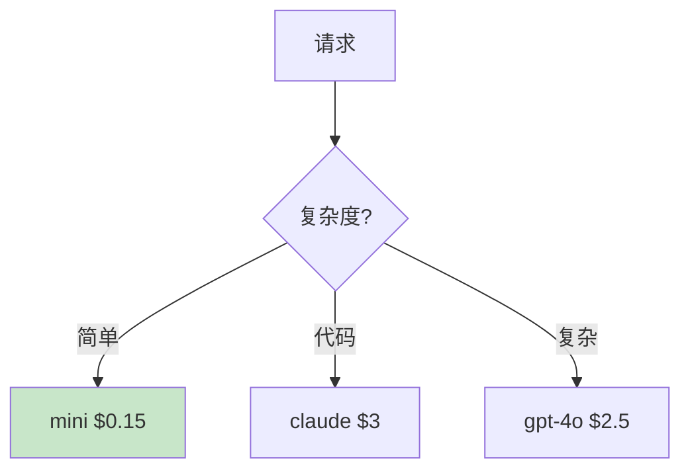
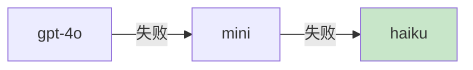

# 多模型路由图解

> 用图解理解路由策略和降级链。

---

## 一、路由

```mermaid
graph TB
    Q["请求"] --> C{"复杂度?"}
    C -->|简单| MINI["mini $0.15"]
    C -->|代码| CLAUDE["claude $3"]
    C -->|复杂| GPT4["gpt-4o $2.5"]

    style MINI fill:#C8E6C9
```

---

## 二、降级链

```mermaid
graph LR
    M1["gpt-4o"] -->|失败| M2["mini"] -->|失败| M3["haiku"]

    style M3 fill:#C8E6C9
```

---

## 三、检查清单

| 检查项 | 状态 |
|--------|------|
| 有路由器 | ☐ |
| 有降级链 | ☐ |
