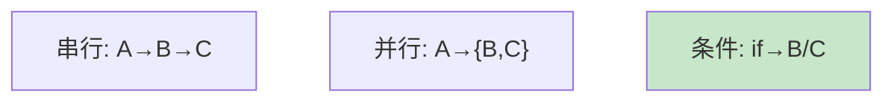

# 工具链编排图解

> 用图解理解工具组合模式。

---

## 一、组合模式

```mermaid
graph TB
    M1["串行: A→B→C"]
    M2["并行: A→{B,C}"]
    M3["条件: if→B/C"]

    style M3 fill:#C8E6C9
```

---

## 二、检查清单

| 检查项 | 状态 |
|--------|------|
| 有串行/并行/条件 | ☐ |
