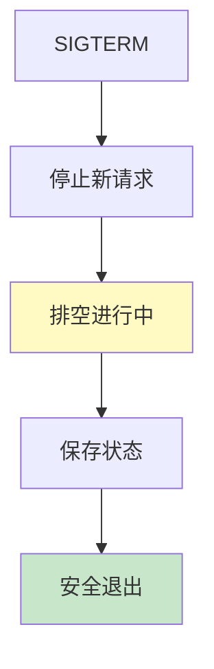

# 优雅关闭图解

> 用图解理解关闭流程。

---

## 一、关闭流程

```mermaid
graph TB
    SIG["SIGTERM"] --> STOP["停止新请求"]
    STOP --> DRAIN["排空进行中"]
    DRAIN --> SAVE["保存状态"]
    SAVE --> EXIT["安全退出"]

    style DRAIN fill:#FFF9C4
    style EXIT fill:#C8E6C9
```

---

## 二、检查清单

| 检查项 | 状态 |
|--------|------|
| 有优雅关闭 | ☐ |
