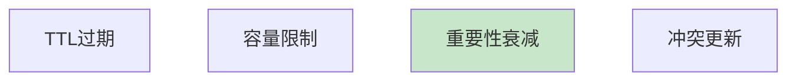

# 记忆遗忘图解

> 用图解理解遗忘策略和压缩。

---

## 一、遗忘策略

```mermaid
graph TB
    F1["TTL过期"]
    F2["容量限制"]
    F3["重要性衰减"]
    F4["冲突更新"]

    style F3 fill:#C8E6C9
```

---

## 二、检查清单

| 检查项 | 状态 |
|--------|------|
| 有遗忘策略 | ☐ |
