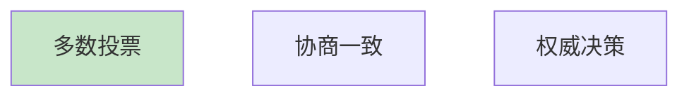

# 共识机制图解

> 用图解理解三种共识方式。

---

## 一、三种方式

```mermaid
graph TB
    M1["多数投票"]
    M2["协商一致"]
    M3["权威决策"]

    style M1 fill:#C8E6C9
```

---

## 二、检查清单

| 检查项 | 状态 |
|--------|------|
| 有投票机制 | ☐ |
| 有协商机制 | ☐ |
