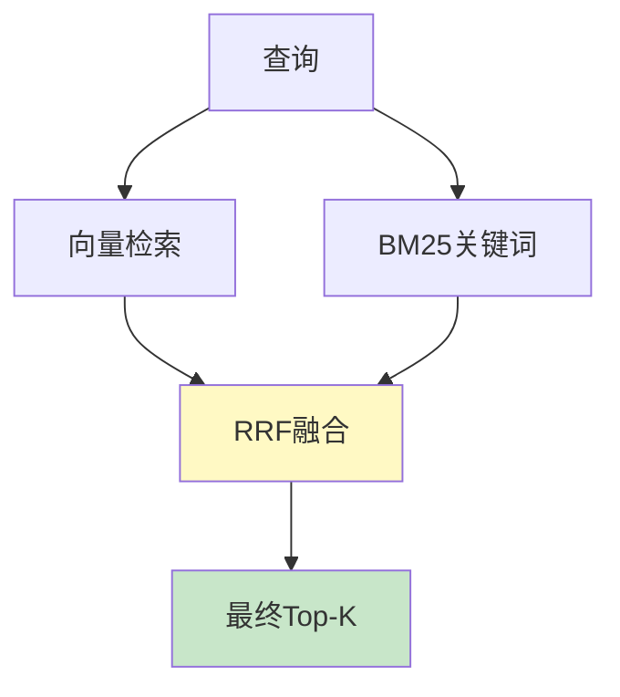

# 混合检索图解

> 用图解理解向量+BM25混合和RRF融合。

---

```mermaid
graph TB
    Q["查询"] --> VEC["向量检索"]
    Q --> KW["BM25关键词"]
    VEC --> FUSE["RRF融合"]
    KW --> FUSE
    FUSE --> FINAL["最终Top-K"]

    style FUSE fill:#FFF9C4
    style FINAL fill:#C8E6C9
```

---

## 检查清单

| 检查项 | 状态 |
|--------|------|
| 有BM25检索器 | ☐ |
| 有RRF融合 | ☐ |
