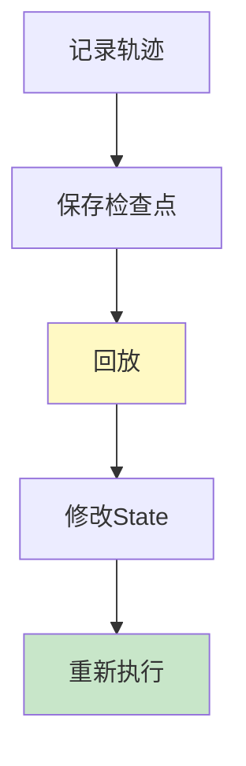

# 决策回放图解

> 用图解理解轨迹记录和回放调试。

---

```mermaid
graph TB
    TRACE["记录轨迹"] --> SAVE["保存检查点"]
    SAVE --> REPLAY["回放"]
    REPLAY --> MODIFY["修改State"]
    MODIFY --> RERUN["重新执行"]

    style REPLAY fill:#FFF9C4
    style RERUN fill:#C8E6C9
```

---

## 检查清单

| 检查项 | 状态 |
|--------|------|
| 有轨迹记录器 | ☐ |
| 有调试会话 | ☐ |
