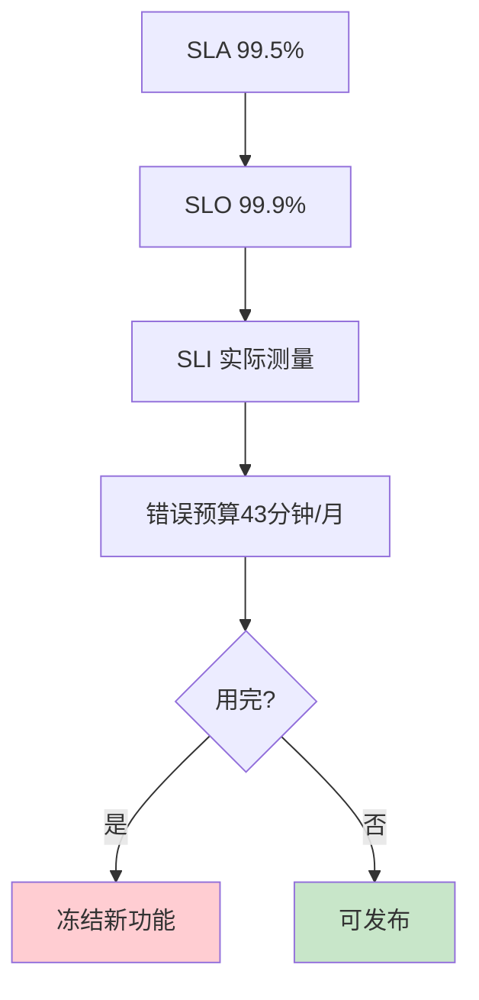

# SLO 告警图解

> 用图解理解SLA/SLO/SLI和错误预算。

---

```mermaid
graph TB
    SLA["SLA 99.5%"] --> SLO["SLO 99.9%"]
    SLO --> SLI["SLI 实际测量"]
    SLI --> BUDGET["错误预算43分钟/月"]
    BUDGET --> CHECK{"用完?"}
    CHECK -->|是| FREEZE["冻结新功能"]
    CHECK -->|否| DEPLOY["可发布"]

    style FREEZE fill:#FFCDD2
    style DEPLOY fill:#C8E6C9
```

---

## 检查清单

| 检查项 | 状态 |
|--------|------|
| 有SLI指标 | ☐ |
| 有错误预算 | ☐ |
