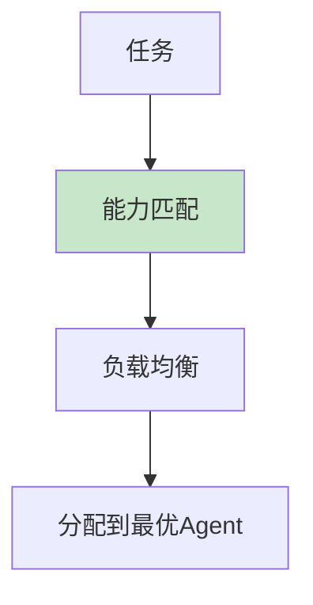

# 任务分配图解

> 用图解理解能力匹配和负载均衡。

---

```mermaid
graph TB
    TASK["任务"] --> MATCH["能力匹配"]
    MATCH --> BALANCE["负载均衡"]
    BALANCE --> ASSIGN["分配到最优Agent"]

    style MATCH fill:#C8E6C9
```

---

## 检查清单

| 检查项 | 状态 |
|--------|------|
| 有任务分配器 | ☐ |
| 有能力匹配 | ☐ |
