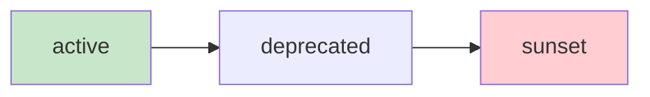

# 工具版本管理图解

> 用图解理解版本状态和兼容性。

---

```mermaid
graph LR
    ACTIVE["active"] --> DEPRECATED["deprecated"]
    DEPRECATED --> SUNSET["sunset"]

    style ACTIVE fill:#C8E6C9
    style SUNSET fill:#FFCDD2
```

---

## 检查清单

| 检查项 | 状态 |
|--------|------|
| 有版本注册表 | ☐ |
| 有废弃流程 | ☐ |
