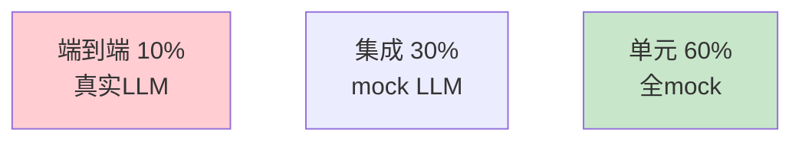

# 图测试策略图解

> 用图解理解测试金字塔和各层策略。

---

```mermaid
graph TB
    TOP["端到端 10%<br/>真实LLM"]
    MID["集成 30%<br/>mock LLM"]
    BASE["单元 60%<br/>全mock"]

    style BASE fill:#C8E6C9
    style TOP fill:#FFCDD2
```

---

## 检查清单

| 检查项 | 状态 |
|--------|------|
| 有测试工具集 | ☐ |
| 有单元测试 | ☐ |
