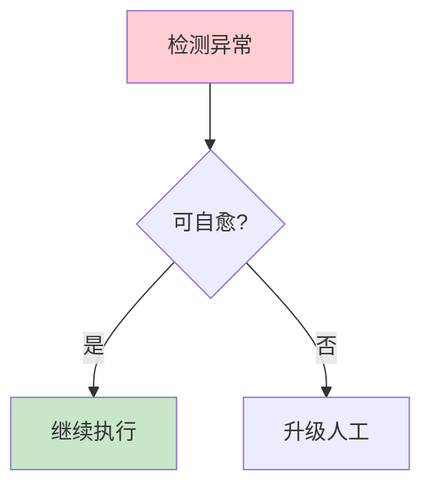

# Agent 自愈图解

> 用图解理解异常检测和自动恢复。

---

```mermaid
graph TB
    DETECT["检测异常"] --> RECOVER{"可自愈?"}
    RECOVER -->|是| RESUME["继续执行"]
    RECOVER -->|否| ESCALATE["升级人工"]

    style DETECT fill:#FFCDD2
    style RESUME fill:#C8E6C9
```

---

## 检查清单

| 检查项 | 状态 |
|--------|------|
| 有异常检测器 | ☐ |
| 有恢复引擎 | ☐ |
