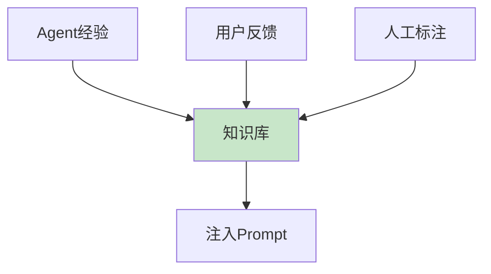

# 知识沉淀图解

> 用图解理解知识来源、沉淀形式和自动提取。

---

```mermaid
graph TB
    S1["Agent经验"] --> KB["知识库"]
    S2["用户反馈"] --> KB
    S3["人工标注"] --> KB
    KB --> INJECT["注入Prompt"]

    style KB fill:#C8E6C9
```

---

## 检查清单

| 检查项 | 状态 |
|--------|------|
| 有知识库 | ☐ |
| 有自动提取 | ☐ |
