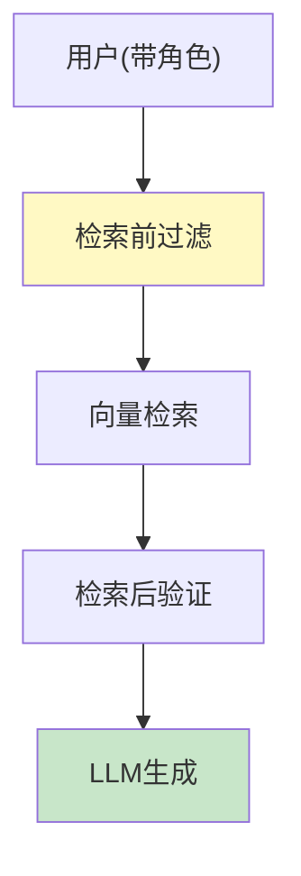

# 文档级权限图解

> 用图解理解 ACL 模型和检索前/后过滤。

---

```mermaid
graph TB
    U["用户(带角色)"] --> PRE["检索前过滤"]
    PRE --> VEC["向量检索"]
    VEC --> POST["检索后验证"]
    POST --> LLM["LLM生成"]

    style PRE fill:#FFF9C4
    style LLM fill:#C8E6C9
```

---

## 检查清单

| 检查项 | 状态 |
|--------|------|
| 有ACL模型 | ☐ |
| 有检索前过滤 | ☐ |
