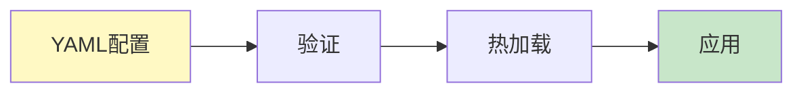

# 配置即代码图解

> 用图解理解 YAML 配置和热更新。

---

```mermaid
graph LR
    YAML["YAML配置"] --> VALIDATE["验证"]
    VALIDATE --> LOAD["热加载"]
    LOAD --> APP["应用"]

    style YAML fill:#FFF9C4
    style APP fill:#C8E6C9
```

---

## 检查清单

| 检查项 | 状态 |
|--------|------|
| 有配置加载器 | ☐ |
| 有热更新 | ☐ |
