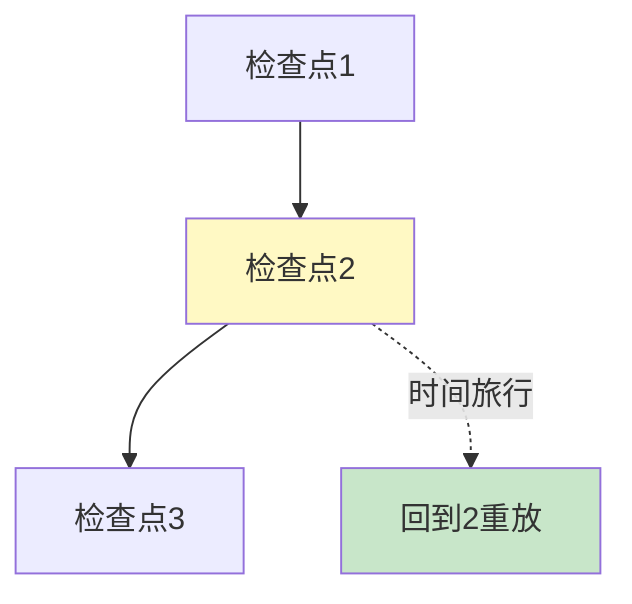

# 状态快照图解

> 用图解理解检查点快照和时间旅行。

---

```mermaid
graph TB
    CP1["检查点1"] --> CP2["检查点2"]
    CP2 --> CP3["检查点3"]
    CP2 -.->|"时间旅行"| REPLAY["回到2重放"]

    style CP2 fill:#FFF9C4
    style REPLAY fill:#C8E6C9
```

---

## 检查清单

| 检查项 | 状态 |
|--------|------|
| 有快照管理器 | ☐ |
| 有状态对比 | ☐ |
