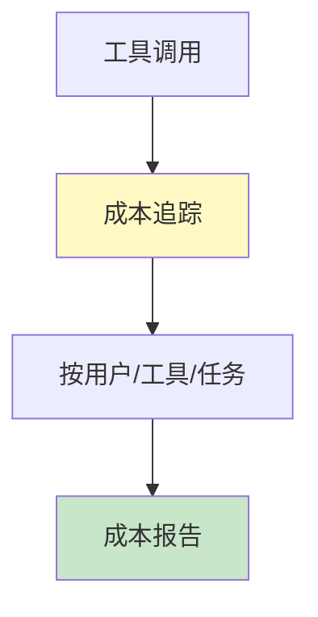

# 成本归因图解

> 用图解理解成本追踪和归因分析。

---

```mermaid
graph TB
    CALL["工具调用"] --> TRACK["成本追踪"]
    TRACK --> ATTR["按用户/工具/任务"]
    ATTR --> REPORT["成本报告"]

    style TRACK fill:#FFF9C4
    style REPORT fill:#C8E6C9
```

---

## 检查清单

| 检查项 | 状态 |
|--------|------|
| 有成本追踪器 | ☐ |
| 有归因分析 | ☐ |
