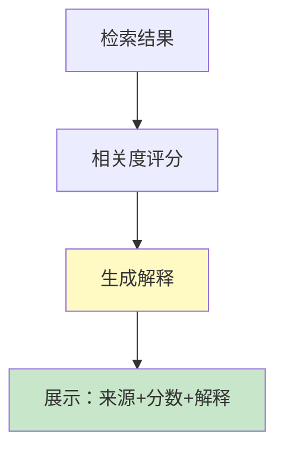

# 检索解释性图解

> 用图解理解检索结果解释和来源标注。

---

```mermaid
graph TB
    RET["检索结果"] --> SCORE["相关度评分"]
    SCORE --> EXPLAIN["生成解释"]
    EXPLAIN --> DISPLAY["展示：来源+分数+解释"]

    style EXPLAIN fill:#FFF9C4
    style DISPLAY fill:#C8E6C9
```

---

## 检查清单

| 检查项 | 状态 |
|--------|------|
| 有解释器 | ☐ |
| 有展示格式 | ☐ |
