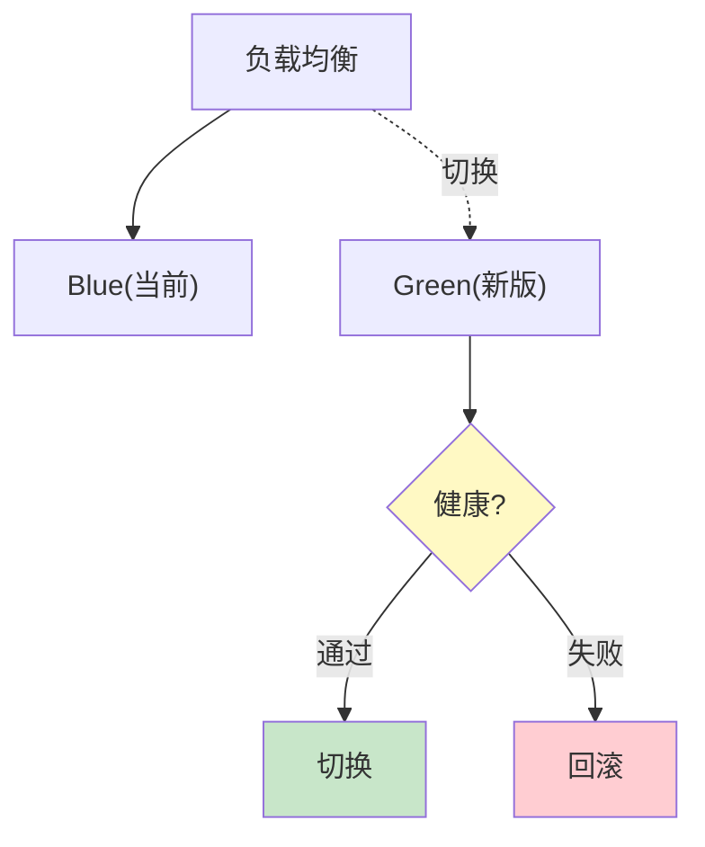

# 蓝绿部署图解

> 用图解理解蓝绿切换和健康探针。

---

```mermaid
graph TB
    LB["负载均衡"] --> BLUE["Blue(当前)"]
    LB -.->|"切换"| GREEN["Green(新版)"]
    GREEN --> HEALTH{"健康?"}
    HEALTH -->|通过| SWITCH["切换"]
    HEALTH -->|失败| ROLLBACK["回滚"]

    style HEALTH fill:#FFF9C4
    style SWITCH fill:#C8E6C9
    style ROLLBACK fill:#FFCDD2
```

---

## 检查清单

| 检查项 | 状态 |
|--------|------|
| 有蓝绿部署器 | ☐ |
| 有健康探针 | ☐ |
