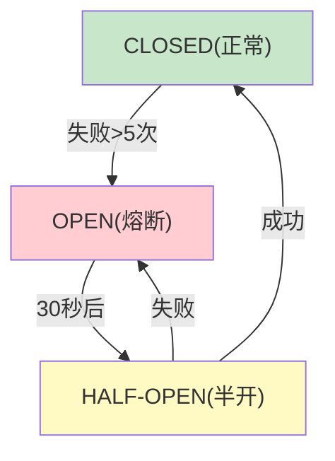

# 断路器图解

> 用图解理解三态状态机。

---

```mermaid
graph TB
    CLOSED["CLOSED(正常)"] -->|"失败>5次"| OPEN["OPEN(熔断)"]
    OPEN -->|"30秒后"| HALF["HALF-OPEN(半开)"]
    HALF -->|成功| CLOSED
    HALF -->|失败| OPEN

    style CLOSED fill:#C8E6C9
    style OPEN fill:#FFCDD2
    style HALF fill:#FFF9C4
```

---

## 检查清单

| 检查项 | 状态 |
|--------|------|
| 有断路器 | ☐ |
| 有三态状态机 | ☐ |
