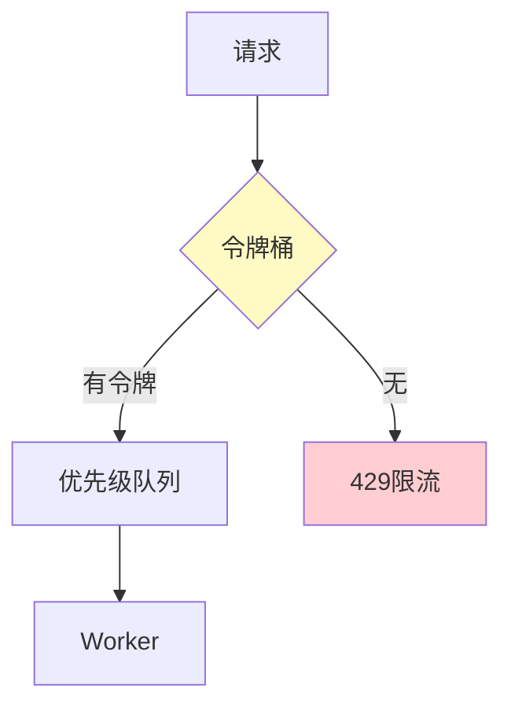

# 流量整形图解

> 用图解理解令牌桶和优先级队列。

---

```mermaid
graph TB
    REQ["请求"] --> BUCKET{"令牌桶"}
    BUCKET -->|有令牌| QUEUE["优先级队列"]
    BUCKET -->|无| REJECT["429限流"]
    QUEUE --> WORKER["Worker"]

    style BUCKET fill:#FFF9C4
    style REJECT fill:#FFCDD2
```

---

## 检查清单

| 检查项 | 状态 |
|--------|------|
| 有令牌桶 | ☐ |
| 有优先级队列 | ☐ |
