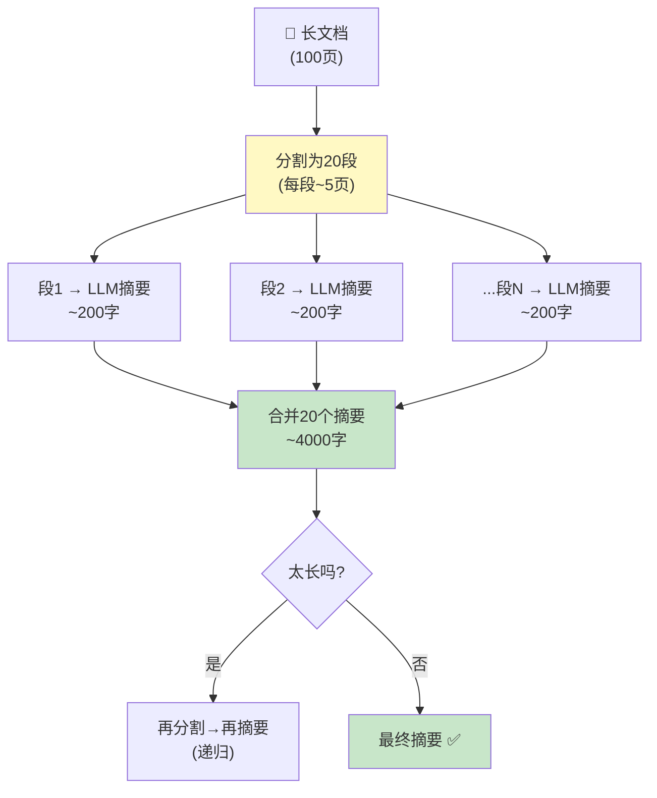
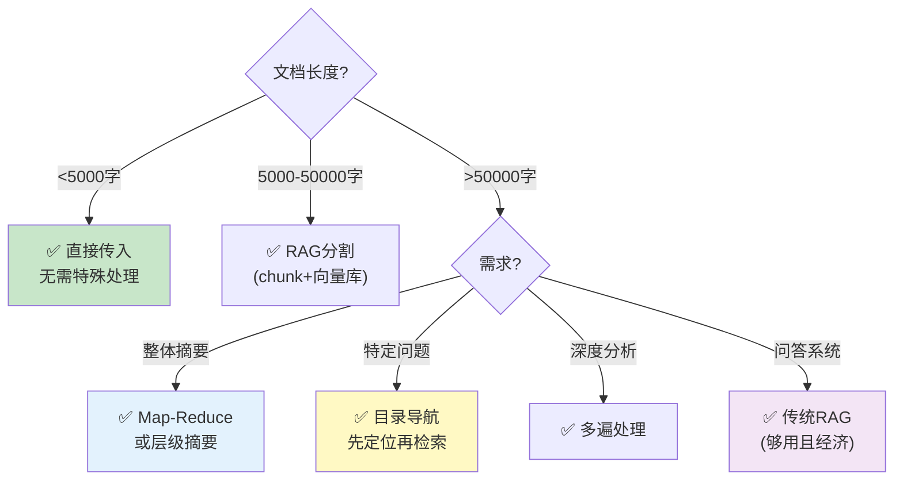

# 长文档处理策略图解

> 用图解理解当文档远超上下文窗口时的处理策略。

---

## 一、长文档的规模问题

```mermaid
graph TB
    subgraph 规模对比 {"文档长度 vs 上下文窗口"}
        SHORT["📄 短文档<br/>~3000字 ≈ 4500 tokens<br/>→ 直接传入 ✅"]
        MID["📋 中文档<br/>~30000字 ≈ 45000 tokens<br/>→ RAG分割处理 ✅"]
        LONG["📚 长文档<br/>~300000字(一本书) ≈ 450000 tokens<br/>→ 需要特殊策略 ⚠️"]
        HUGE["📖 超长文档<br/>~1000000字 ≈ 1500000 tokens<br/>→ 必须多级处理 ⚠️"]
    end

    LONG --> NOTE["GPT-4o-mini窗口128K<br/>一本书轻松超出3-10倍"]

    style SHORT fill:#C8E6C9
    style LONG fill:#FFE0B2
    style HUGE fill:#FFCDD2
```

## 二、Map-Reduce 摘要策略



## 三、层级摘要策略

```mermaid
graph TB
    subgraph 层级结构 {"从粗到细的层级摘要"}
        L1["全书摘要 (~500字)<br/>'本书介绍了AI的基础概念...'"]
        L1 --> L2_1["第1章摘要<br/>'AI的定义和历史'"]
        L1 --> L2_2["第2章摘要<br/>'机器学习基础'"]
        L1 --> L2_3["第3章摘要<br/>'深度学习原理'"]

        L2_1 --> L3_1["1.1节: AI的起源"]
        L2_1 --> L3_2["1.2节: AI的发展史"]

        L2_2 --> L3_3["2.1节: 什么是ML"]
        L2_2 --> L3_4["2.2节: 监督学习"]
    end

    NOTE["检索时：先匹配章节摘要→再深入具体段落"]

    style L1 fill:#E3F2FD
    style 层级结构 fill:#E3F2FD
    style NOTE fill:#C8E6C9
```

## 四、目录导航检索策略

```mermaid
graph TB
    Q["用户问题:<br/>'深度学习的原理是什么？'"] --> TOC["Step 1: 检索目录"]
    TOC --> FOUND["找到: 第3章 '深度学习原理'<br/>第3.2节 '神经网络基础'"]
    FOUND --> DEEP["Step 2: 只检索第3章的内容"]
    DEEP --> ANSWER["Step 3: LLM基于第3章回答"]

    NOTE["优势: 不在全文中检索(噪声多)<br/>先定位再深入(精准)"]

    style TOC fill:#FFF9C4
    style DEEP fill:#C8E6C9
    style NOTE fill:#E3F2FD
```



## 五、多遍处理策略

```mermaid
graph TB
    subgraph 第一遍 {"第1遍：快速扫描"}
        D1["全文分段"] --> S1["每段快速读取<br/>提取关键实体和要点"]
        S1 --> I1["中间结果：<br/>关键实体列表<br/>重要段落标记<br/>章节主题"]
    end

    subgraph 第二遍 {"第2遍：深入分析"}
        I1 --> S2["基于第1遍标记<br/>只读取相关段落"]
        S2 --> A2["生成深入分析<br/>综合回答"]
    end

    style 第一遍 fill:#E3F2FD
    style 第二遍 fill:#C8E6C9
```

## 六、策略选择决策树



## 七、成本对比

```mermaid
graph TB
    subgraph 成本对比 {"LLM调用次数对比"}
        DIRECT["直接传入<br/>1次调用<br/>成本: ★☆☆☆<br/>(但可能超限)"]
        MAP["Map-Reduce<br/>N+1次调用<br/>成本: ★★★☆"]
        TOC["目录导航<br/>2次调用<br/>成本: ★★☆☆"]
        MULTI["多遍处理<br/>2N+1次调用<br/>成本: ★★★★★"]
        RAG["传统RAG<br/>1次调用<br/>(建库不含)<br/>成本: ★☆☆☆"]
    end

    style RAG fill:#C8E6C9
    style MULTI fill:#FFCDD2
```
