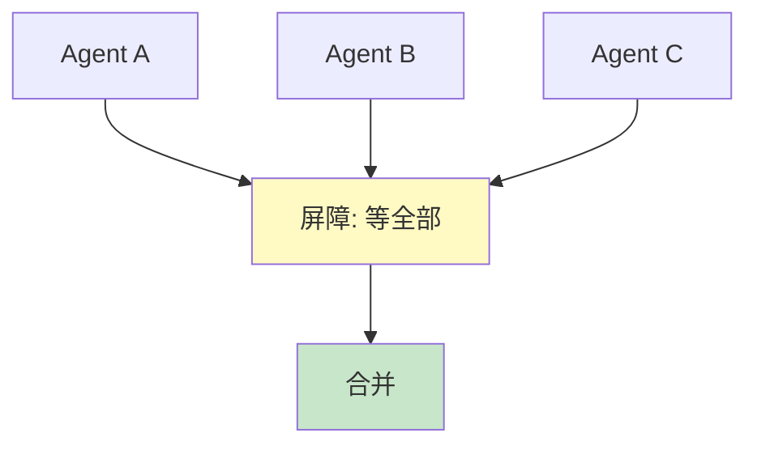

# 状态同步图解

> 用图解理解并行同步和屏障机制。

---

```mermaid
graph TB
    A["Agent A"] --> BARRIER["屏障: 等全部"]
    B["Agent B"] --> BARRIER
    C["Agent C"] --> BARRIER
    BARRIER --> MERGE["合并"]

    style BARRIER fill:#FFF9C4
    style MERGE fill:#C8E6C9
```

---

## 检查清单

| 检查项 | 状态 |
|--------|------|
| 有并行图构建 | ☐ |
| 有冲突解决 | ☐ |
