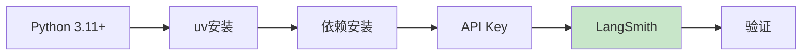

# 前置知识图解

> 用图解理解环境配置6步。

---

```mermaid
graph LR
    S1["Python 3.11+"] --> S2["uv安装"]
    S2 --> S3["依赖安装"]
    S3 --> S4["API Key"]
    S4 --> S5["LangSmith"]
    S5 --> S6["验证"]

    style S5 fill:#C8E6C9
```

---

## 检查清单

| 检查项 | 状态 |
|--------|------|
| Python就绪 | ☐ |
| 依赖已装 | ☐ |
