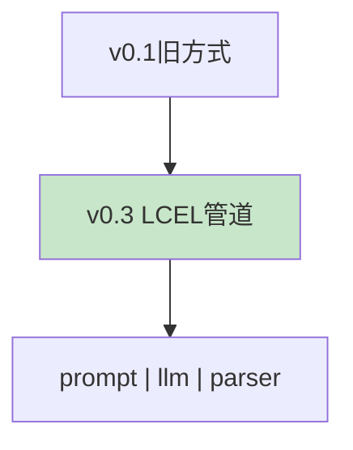

# LangChain 入门图解

> 用图解理解 v0.3 变化和 LCEL 管道。

---

```mermaid
graph TB
    OLD["v0.1旧方式"] --> NEW["v0.3 LCEL管道"]
    NEW --> PIPE["prompt | llm | parser"]

    style NEW fill:#C8E6C9
```

---

## 检查清单

| 检查项 | 状态 |
|--------|------|
| 知道v0.3变化 | ☐ |
| 能用LCEL管道 | ☐ |
