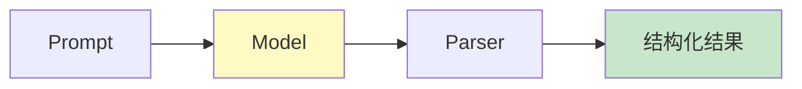

# 核心概念图解

> 用图解理解 Models、Prompts、Parsers。

---

```mermaid
graph LR
    P["Prompt"] --> L["Model"]
    L --> O["Parser"]
    O --> R["结构化结果"]

    style L fill:#FFF9C4
    style R fill:#C8E6C9
```

---

## 检查清单

| 检查项 | 状态 |
|--------|------|
| 理解三大概念 | ☐ |
