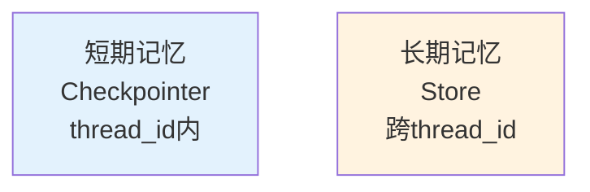

# Memory 机制图解

> 用图解理解短期记忆和长期记忆。

---

```mermaid
graph TB
    SHORT["短期记忆<br/>Checkpointer<br/>thread_id内"]
    LONG["长期记忆<br/>Store<br/>跨thread_id"]

    style SHORT fill:#E3F2FD
    style LONG fill:#FFF3E0
```

---

## 检查清单

| 检查项 | 状态 |
|--------|------|
| 理解短期vs长期 | ☐ |
