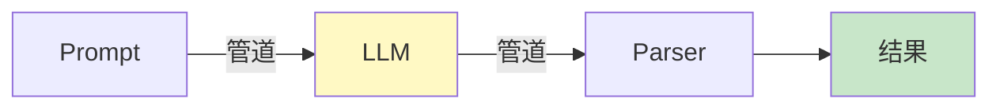

# Chains 链式调用图解

> 用图解理解 LCEL 管道和高级组合。

---

```mermaid
graph LR
    P["Prompt"] -->|管道| L["LLM"]
    L -->|管道| O["Parser"]
    O --> R["结果"]

    style L fill:#FFF9C4
    style R fill:#C8E6C9
```

---

## 检查清单

| 检查项 | 状态 |
|--------|------|
| 能用LCEL组合 | ☐ |
