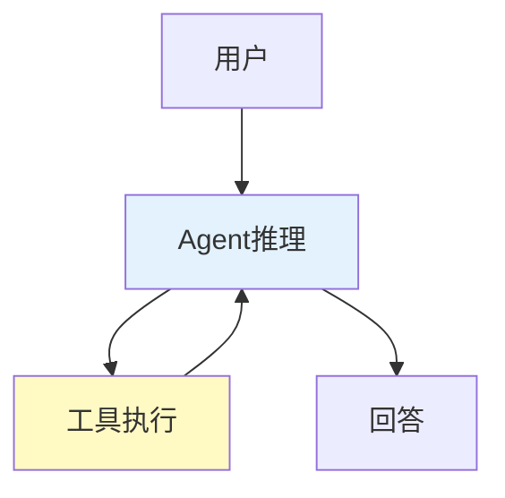

# Agents 与 Tools 图解

> 用图解理解 ReAct 循环和工具调用。

---

```mermaid
graph TB
    USER["用户"] --> AGENT["Agent推理"]
    AGENT --> TOOLS["工具执行"]
    TOOLS --> AGENT
    AGENT --> ANSWER["回答"]

    style AGENT fill:#E3F2FD
    style TOOLS fill:#FFF9C4
```

---

## 检查清单

| 检查项 | 状态 |
|--------|------|
| 能创建Agent | ☐ |
| 能定义工具 | ☐ |
