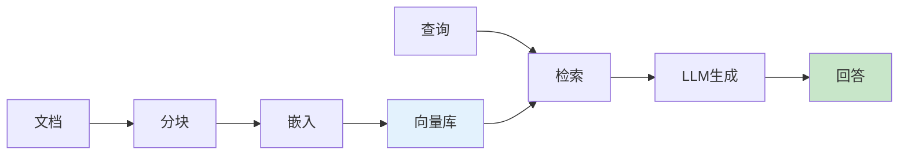

# RAG 全流程图解

> 用图解理解离线建库和在线检索。

---

```mermaid
graph LR
    D["文档"] --> SPLIT["分块"]
    SPLIT --> EMBED["嵌入"]
    EMBED --> STORE["向量库"]
    Q["查询"] --> RET["检索"]
    STORE --> RET
    RET --> GEN["LLM生成"]
    GEN --> A["回答"]

    style STORE fill:#E3F2FD
    style A fill:#C8E6C9
```

---

## 检查清单

| 检查项 | 状态 |
|--------|------|
| 能建向量库 | ☐ |
| 能构建RAG | ☐ |
