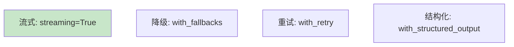

# LangChain 进阶图解

> 用图解理解流式、降级和结构化输出。

---

```mermaid
graph TB
    T1["流式: streaming=True"]
    T2["降级: with_fallbacks"]
    T3["重试: with_retry"]
    T4["结构化: with_structured_output"]

    style T1 fill:#C8E6C9
```

---

## 检查清单

| 检查项 | 状态 |
|--------|------|
| 能流式输出 | ☐ |
| 能降级重试 | ☐ |
