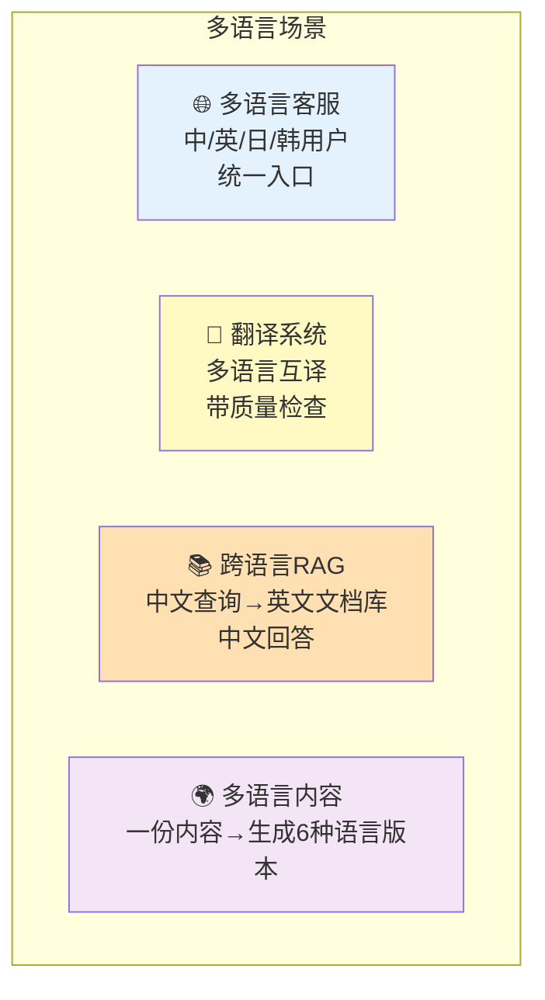
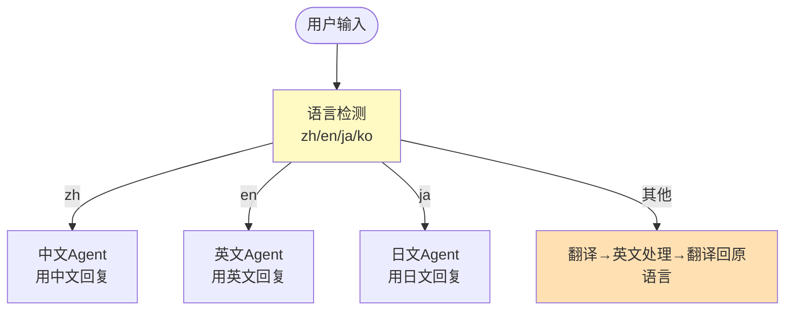
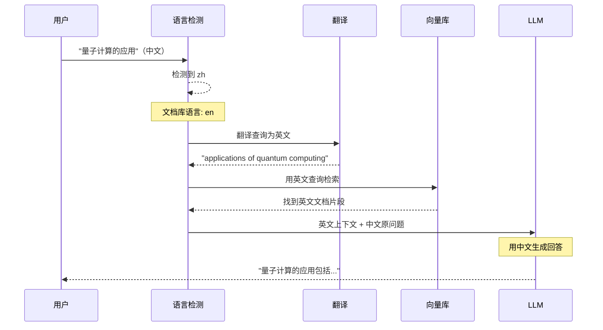
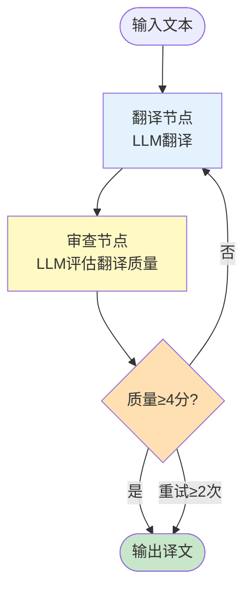
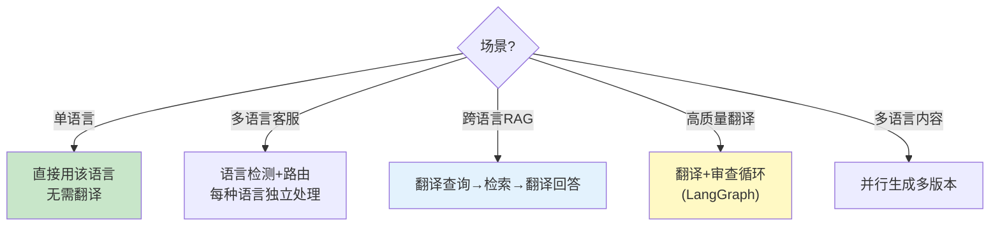

# 多语言架构图解

> 用图解理解多语言应用的语言检测、翻译和跨语言 RAG 架构。

---

## 一、多语言应用场景



## 二、语言检测路由



## 三、跨语言 RAG 数据流



## 四、翻译 Agent 架构



## 五、多语言内容生成

```mermaid
graph TB
    INPUT["中文内容<br/>'产品介绍...'"] --> GEN

    subgraph GEN ["并行生成多语言版本"}
        G1["英文版"]
        G2["日文版"]
        G3["韩文版"]
        G4["法文版"]
        G5["德文版"]
    end

    GEN --> OUT["多语言内容库"]

    style GEN fill:#E3F2FD
    style OUT fill:#C8E6C9
```

## 六、策略选择


