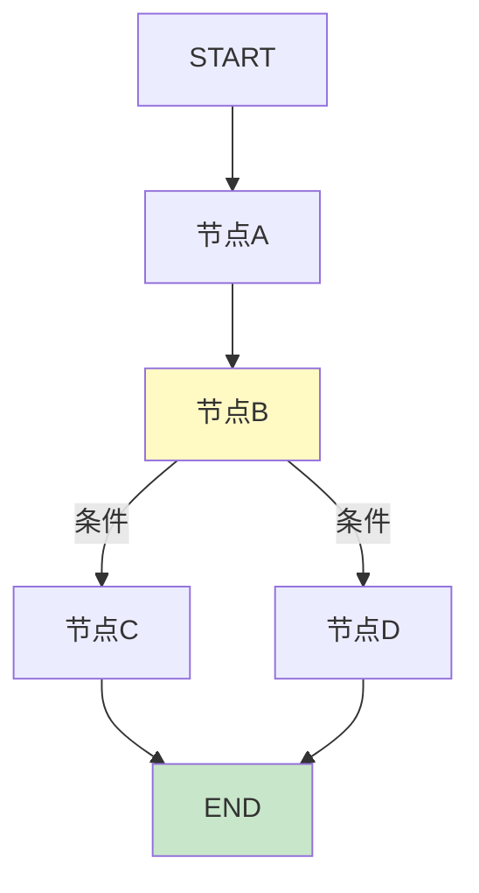

# LangGraph 入门图解

> 用图解理解节点和边。

---

```mermaid
graph TB
    START --> A["节点A"] --> B["节点B"]
    B -->|"条件"| C["节点C"]
    B -->|"条件"| D["节点D"]
    C & D --> END

    style B fill:#FFF9C4
    style END fill:#C8E6C9
```

---

## 检查清单

| 检查项 | 状态 |
|--------|------|
| 能构建图 | ☐ |
| 能用条件边 | ☐ |
