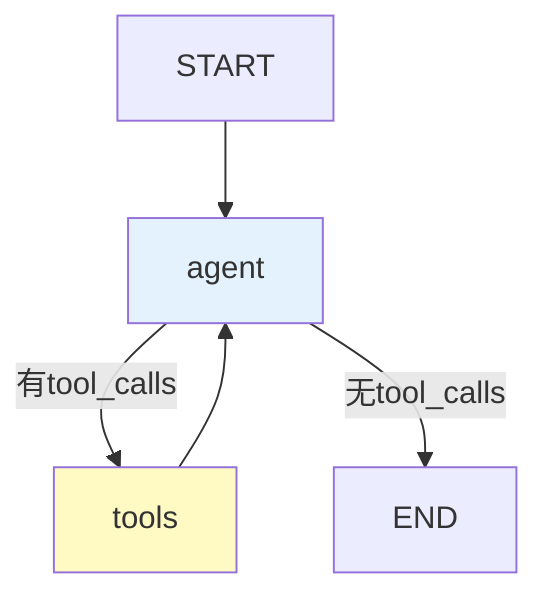

# LangGraph 核心概念图解

> 用图解理解 State/Reducer 和循环。

---

```mermaid
graph TB
    START --> AGENT["agent"]
    AGENT -->|"有tool_calls"| TOOLS["tools"]
    AGENT -->|"无tool_calls"| END
    TOOLS --> AGENT

    style AGENT fill:#E3F2FD
    style TOOLS fill:#FFF9C4
```

---

## 检查清单

| 检查项 | 状态 |
|--------|------|
| 理解State+Reducer | ☐ |
| 能用循环 | ☐ |
