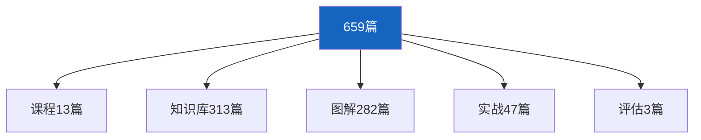
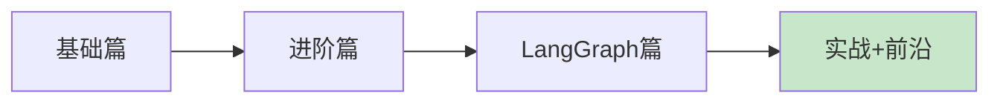

# 课程总览图解

> 用图解理解知识体系和四阶段路径。

---

```mermaid
graph TB
    ROOT["659篇"] --> C1["课程13篇"]
    ROOT --> C2["知识库313篇"]
    ROOT --> C3["图解282篇"]
    ROOT --> C4["实战47篇"]
    ROOT --> C5["评估3篇"]

    style ROOT fill:#1565C0,color:#fff
```

---

```mermaid
graph LR
    A["基础篇"] --> B["进阶篇"]
    B --> C["LangGraph篇"]
    C --> D["实战+前沿"]

    style D fill:#C8E6C9
```

---

## 检查清单

| 检查项 | 状态 |
|--------|------|
| 知道四阶段 | ☐ |
