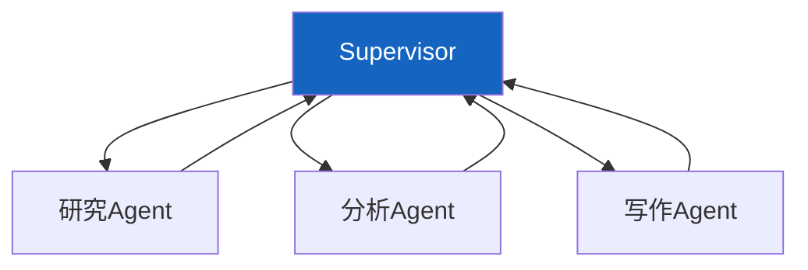

# 复杂工作流图解

> 用图解理解多 Agent 架构和人机交互。

---

```mermaid
graph TB
    SUP["Supervisor"] --> A1["研究Agent"]
    SUP --> A2["分析Agent"]
    SUP --> A3["写作Agent"]
    A1 & A2 & A3 --> SUP

    style SUP fill:#1565C0,color:#fff
```

---

## 检查清单

| 检查项 | 状态 |
|--------|------|
| 能构建多Agent | ☐ |
