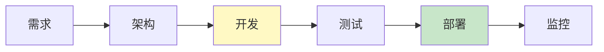

# 实战项目图解

> 用图解理解从零到一的项目流程。

---

```mermaid
graph LR
    REQ["需求"] --> ARCH["架构"]
    ARCH --> DEV["开发"]
    DEV --> TEST["测试"]
    TEST --> DEPLOY["部署"]
    DEPLOY --> MON["监控"]

    style DEV fill:#FFF9C4
    style DEPLOY fill:#C8E6C9
```

---

## 检查清单

| 检查项 | 状态 |
|--------|------|
| 能从零构建 | ☐ |
