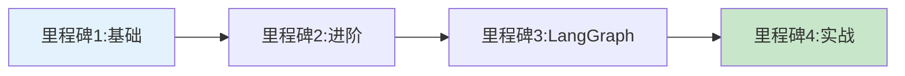

# 学习里程碑图解

> 用图解理解四阶段里程碑。

---

```mermaid
graph LR
    M1["里程碑1:基础"] --> M2["里程碑2:进阶"]
    M2 --> M3["里程碑3:LangGraph"]
    M3 --> M4["里程碑4:实战"]

    style M1 fill:#E3F2FD
    style M4 fill:#C8E6C9
```

---

## 检查清单

| 里程碑 | 达成 |
|--------|------|
| 基础篇 | ☐ |
| 进阶篇 | ☐ |
| LangGraph篇 | ☐ |
| 实战篇 | ☐ |
