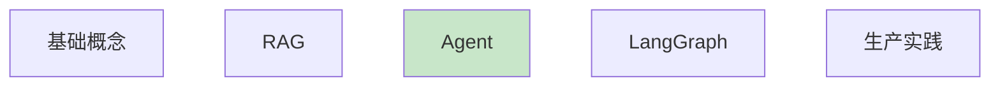

# 知识检验图解

> 用图解理解题库分类。

---

```mermaid
graph TB
    C1["基础概念"]
    C2["RAG"]
    C3["Agent"]
    C4["LangGraph"]
    C5["生产实践"]

    style C3 fill:#C8E6C9
```

---

## 检查清单

| 题库类别 | 已掌握 |
|----------|--------|
| 基础 | ☐ |
| RAG | ☐ |
| Agent | ☐ |
| LangGraph | ☐ |
| 生产 | ☐ |
