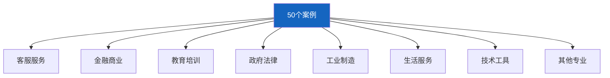

# 案例库导读图解

> 用图解理解 50 个案例分类和学习路径。

---

```mermaid
graph TB
    ROOT["50个案例"] --> C1["客服服务"]
    ROOT --> C2["金融商业"]
    ROOT --> C3["教育培训"]
    ROOT --> C4["政府法律"]
    ROOT --> C5["工业制造"]
    ROOT --> C6["生活服务"]
    ROOT --> C7["技术工具"]
    ROOT --> C8["其他专业"]

    style ROOT fill:#1565C0,color:#fff
```

---

## 检查清单

| 检查项 | 状态 |
|--------|------|
| 知道分类 | ☐ |
