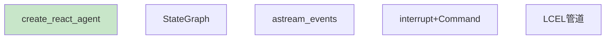

# 速查卡图解

> 用图解理解核心 API 和模式速查。

---

```mermaid
graph TB
    A1["create_react_agent"]
    A2["StateGraph"]
    A3["astream_events"]
    A4["interrupt+Command"]
    A5["LCEL管道"]

    style A1 fill:#C8E6C9
```

---

## 检查清单

| 检查项 | 状态 |
|--------|------|
| 有API速查 | ☐ |
| 有模式速查 | ☐ |
