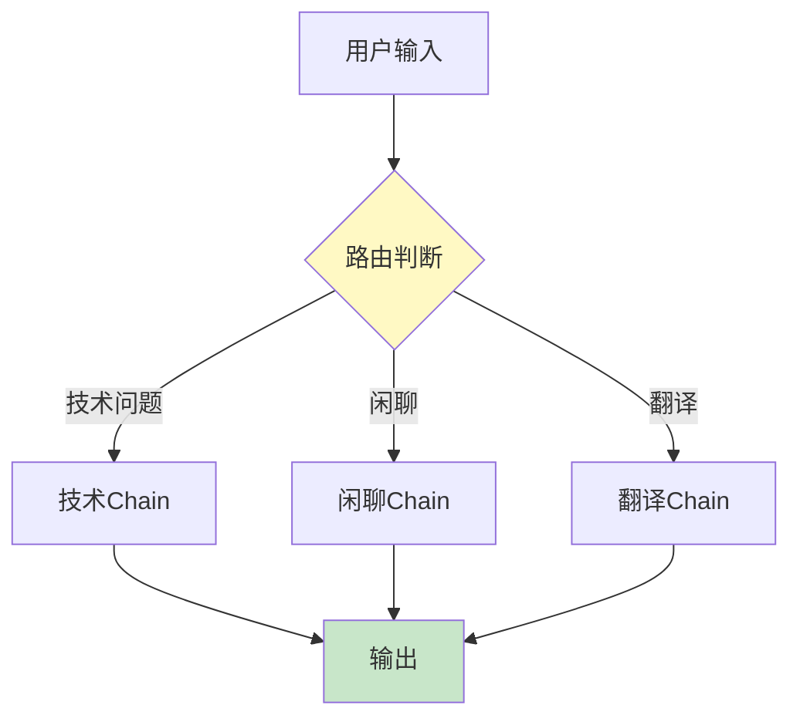
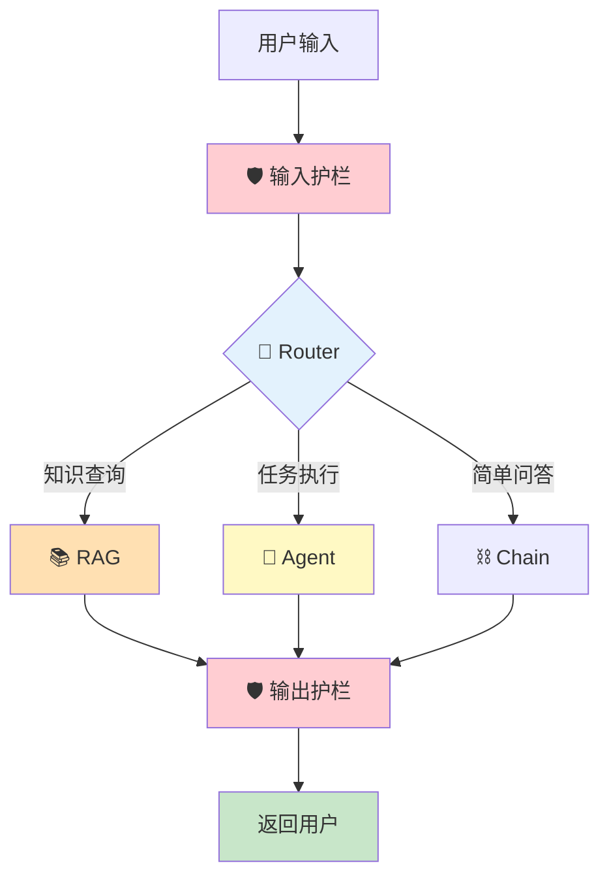
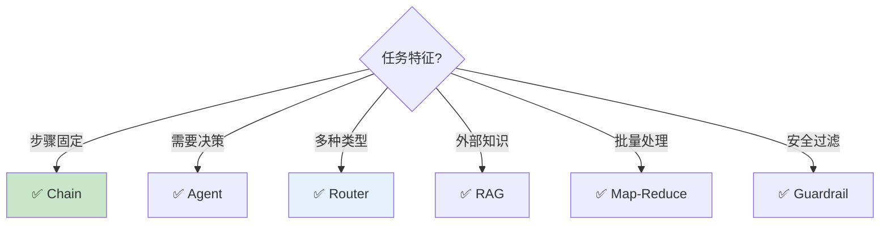

# LLM 应用设计模式图解

> 用图解理解六种核心设计模式及其组合方式。

---

## 一、六大设计模式

```mermaid
graph TB
    subgraph 六大模式 {"LLM 应用六大设计模式"}
        P1["🔄 Router<br/>路由模式<br/>分派到不同处理"]
        P2["⛓️ Chain<br/>链模式<br/>固定步骤串联"]
        P3["🤖 Agent<br/>代理模式<br/>动态决策"]
        P4["📚 RAG<br/>检索增强<br/>外挂知识"]
        P5["🔁 Map-Reduce<br/>分而治之<br/>批量处理"]
        P6["🛡️ Guardrail<br/>护栏模式<br/>输入输出过滤"]
    end

    style P1 fill:#E3F2FD
    style P2 fill:#C8E6C9
    style P3 fill:#FFF9C4
    style P4 fill:#FFE0B2
    style P5 fill:#F3E5F5
    style P6 fill:#FFCDD2
```

## 二、Router 路由模式



## 三、Agent 模式变体

```mermaid
graph TB
    subgraph ReAct {"ReAct Agent"}
        R1["思考→行动→观察→循环"]
    end

    subgraph PlanExecute {"Plan-and-Execute"}
        P1["先规划全部步骤"] --> P2["逐步执行"]
    end

    subgraph Reflection {"Reflection"}
        F1["生成→评价→改进"]
    end

    subgraph Supervisor {"Supervisor"}
        S1["主控→分派子Agent→汇总"]
    end

    style ReAct fill:#C8E6C9
    style PlanExecute fill:#E3F2FD
    style Reflection fill:#FFE0B2
    style Supervisor fill:#F3E5F5
```

## 四、真实应用：多模式组合



## 五、模式选择决策



## 六、反模式

```mermaid
graph TB
    subgraph 反模式 {"❌ 常见误用"}
        B1["简单任务用Agent<br/>(杀鸡用牛刀)"]
        B2["单一类型用Router<br/>(多此一举)"]
        B3["模型已知知识用RAG<br/>(浪费)"]
        B4["小数据用Map-Reduce<br/>(过度工程)"]
    end

    style 反模式 fill:#FFCDD2
```
