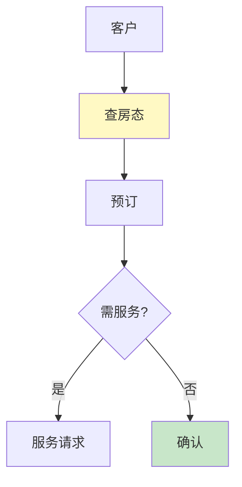

# 酒店管理图解

> 用图解理解酒店 Agent 流程。

---

```mermaid
graph TB
    U["客户"] --> CHECK["查房态"]
    CHECK --> BOOK["预订"]
    BOOK --> SERVICE{"需服务?"}
    SERVICE -->|是| REQ["服务请求"]
    SERVICE -->|否| CONFIRM["确认"]

    style CHECK fill:#FFF9C4
    style CONFIRM fill:#C8E6C9
```

---

## 检查清单

| 检查项 | 状态 |
|--------|------|
| 有房态查询 | ☐ |
| 有预订管理 | ☐ |
