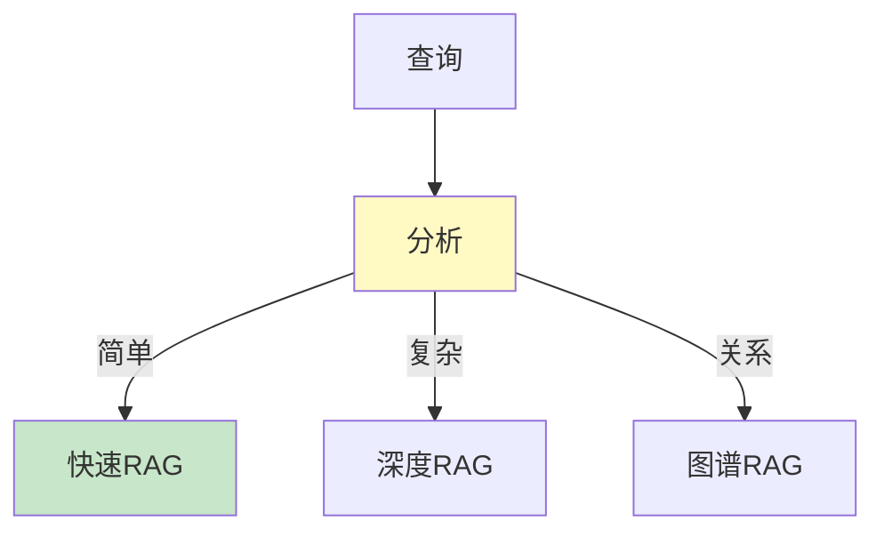

# RAG 自适应图解

> 用图解理解查询分析和策略选择。

---

```mermaid
graph TB
    Q["查询"] --> ANALYZE["分析"]
    ANALYZE -->|简单| FAST["快速RAG"]
    ANALYZE -->|复杂| DEEP["深度RAG"]
    ANALYZE -->|关系| GRAPH["图谱RAG"]

    style ANALYZE fill:#FFF9C4
    style FAST fill:#C8E6C9
```

---

## 检查清单

| 检查项 | 状态 |
|--------|------|
| 有自适应分析器 | ☐ |
